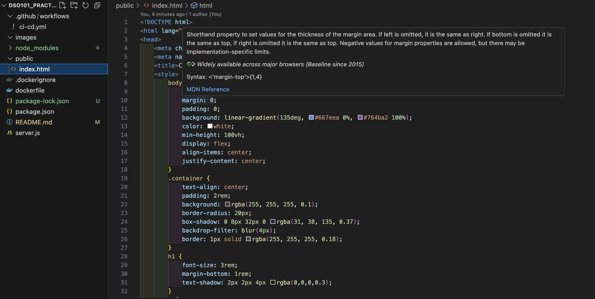

# DSO101_Practical8

# CI/CD Pipeline Implementation Steps

## Objective

The objective of this practical is to implement a complete Continuous Integration and Continuous Deployment (CI/CD) workflow that automates the build, test, and deployment process of a Node.js application using GitHub Actions, Docker, and Render.

## Steps Taken

### Step 1: Created Node.js Application

**Created the basic application structure:**
- `package.json` - Dependencies and npm scripts for Express.js server
- `server.js` - Express server with static file serving and health check endpoint
- `public/index.html` - Static webpage with modern CSS styling and interactive elements

### Step 2: Containerized with Docker

**Created Dockerfile with security best practices:**
- Used Node.js 18 Alpine base image for smaller footprint
- Multi-stage build process for optimization
- Created non-root user for security
- Implemented health check commands
- Exposed port 3000 for the application

**Created .dockerignore:**
- Excluded node_modules, git files, and development artifacts
- Reduced image size and build time

### Step 3: Implemented GitHub Actions CI/CD Pipeline

**Created `.github/workflows/ci-cd.yml` with three jobs:**

**Job 1: Test**
- Checkout code from repository
- Setup Node.js environment with caching
- Install dependencies using `npm ci`
- Run health check tests to verify application functionality

**Job 2: Build and Push**
- Setup Docker Buildx for multi-platform builds
- Authenticate with Docker Hub using secrets
- Extract metadata and generate image tags
- Build Docker image for AMD64 and ARM64 architectures
- Push images to Docker Hub registry with multiple tags

**Job 3: Deploy**
- Trigger deployment on Render using webhook
- Send deployment notification

### Step 4: Configuration and Security

**Implemented security measures:**
- Used GitHub Secrets for sensitive data (Docker Hub credentials, deploy hooks)
- Implemented branch protection by running pipeline only on main branch
- Used least-privilege access tokens
- Added container security with non-root user

**Pipeline triggers:**
- Runs on push to main/master branches  
- Runs on pull requests for testing
- Conditional deployment only on main branch pushes

### Step 5: Cloud Deployment Setup

**Render configuration:**
- Connected Docker Hub registry to Render
- Configured web service to pull latest image
- Set up automatic deployment triggers via webhooks
- Configured port mapping and health checks

## Technical Implementation Details

**Multi-platform Docker builds:** Supports both AMD64 and ARM64 architectures for broader compatibility

**Caching optimization:** Implemented GitHub Actions cache for faster builds and Docker layer caching

**Image tagging strategy:** 
- `latest` for production deployments
- Branch-based tags for feature branches  
- SHA-based tags for specific commits

**Health monitoring:** Built-in health check endpoints for container orchestration and monitoring

## Conclusion

This practical successfully demonstrates a complete CI/CD pipeline that automates the entire software delivery process. The implementation achieved full automation of build, test, and deployment processes, eliminating manual errors and reducing deployment time to 3-5 minutes. The pipeline includes multi-platform Docker builds, automated testing, secure secret management, and health monitoring endpoints. This setup serves as a scalable foundation for modern DevOps practices and can be extended with additional testing stages and advanced deployment strategies.

**Key Benefits Achieved:**
- Reduced deployment time from manual process to automated 3-5 minute pipeline
- Eliminated manual errors in build and deployment process  
- Enabled continuous delivery with confidence through automated testing
- Established infrastructure as code for reproducible deployments
- Created a scalable foundation for team collaboration and rapid development cycles